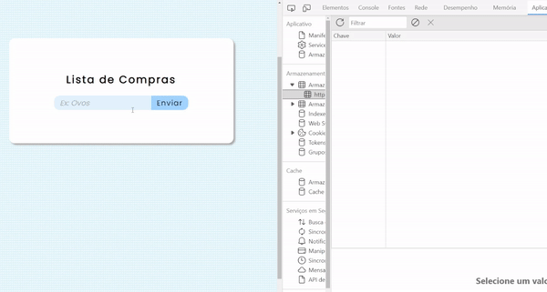

Projeto um pouco mais complexo utilizando armazenamento local para que ao atualizar a página os dados continuam sendo apresentados. 
  

  
<em>Esse projeto pertence ao curso de John Smilga onde o foco é a prática de métodos JS</em>
